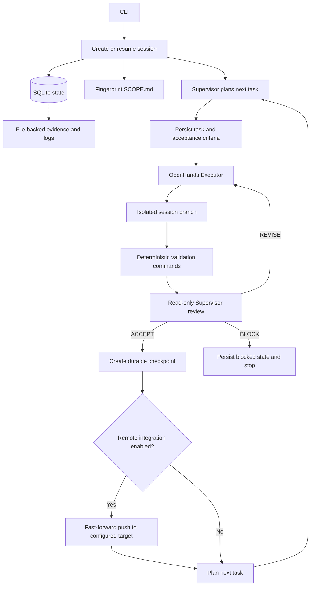

# Code Agent Runtime

Code Agent Runtime is a project-agnostic orchestration service for autonomous software work. It coordinates an OpenHands **Executor** and a read-only **Supervisor** in a durable loop: the Supervisor plans a small task, the Executor works in an isolated Git session branch, deterministic checks run, and the Supervisor accepts the result, requests a revision, or blocks the session.

The runtime owns orchestration, validation, state, recovery, and Git integration. The repository being worked on supplies the product scope, operating rules, source code, and its own validation commands.

## Architecture



### Design principles

- **Small, reviewable tasks:** The Supervisor plans one task at a time with an objective, instructions, and acceptance criteria. It compares repository evidence and completed work with `SCOPE.md` to avoid repeating milestones that are already implemented.
- **A review gate on every task:** After each Executor run, configured validations execute and their results are supplied to the Supervisor. Only an `ACCEPT` decision can create an accepted checkpoint. `REVISE` starts another iteration for that task; `BLOCK` stops the session.
- **Runtime-owned protocols:** The runtime validates and normalizes the Supervisor's planning and review messages. Invalid responses are rejected and saved for diagnosis rather than silently interpreted.
- **Durable state outside the target repository:** SQLite stores sessions, tasks, iterations, decisions, checkpoints, events, artifact references, and workspace leases. Large logs, diffs, and response evidence are kept as files and indexed by hashes.
- **Recovery without discarding work:** Startup recovery compares the expected session branch, base commit, latest accepted checkpoint, scope fingerprint, and current workspace status. Unexpected changes block the run for inspection; the runtime does not hard-reset or clean user work.
- **Bounded model context:** Scope text, instructions, Git diffs, validation information, and repository inventories have configured size limits. Full terminal output is preserved separately when OpenHands truncates what it displays.
- **Opt-in remote integration:** With `--enable-push`, the runtime synchronizes the configured remote target into the isolated session branch, asks the Executor to resolve merge conflicts when they occur, then requires validation and Supervisor acceptance before pushing. Pushes are ordinary fast-forward pushes; the runtime never force-pushes.

### Task lifecycle

1. The CLI validates the workspace, creates or loads a session, fingerprints its required `SCOPE.md`, and chooses the runtime-owned branch (by default, `agent/<session-id>`).
2. The runtime acquires a lease for the workspace and reconciles it with persisted state.
3. If there is no task to resume, the Supervisor plans the next task using the scope, project guidance, bounded Git inventory/history, and completed tasks.
4. The Executor receives the task, scope, prior review instructions, and bounded Git context. It has OpenHands terminal and file-editor tools in the target workspace.
5. The runtime runs each configured validation command sequentially and saves stdout and stderr as artifacts.
6. A read-only Supervisor reviews the task criteria, diff, changed files, validation result, and repository context. The Supervisor has no tools and cannot modify the workspace.
7. On acceptance, the runtime checkpoints the work and, if enabled, publishes it to the configured remote target. It then plans the next task until the Supervisor returns `DONE`, blocks, or a configured limit is reached.

### Main modules

| Module | Responsibility |
| --- | --- |
| `runtime/cli.py` | Command-line parsing, environment configuration, session creation/resumption, and exit status. |
| `runtime/orchestrator.py` | Supervisor/Executor lifecycle, validation and review gates, task planning, checkpointing, and limits. |
| `runtime/protocol.py` | Typed Supervisor plan, Supervisor decision, and Executor report contracts. |
| `runtime/models.py` | Session, task, iteration, checkpoint, and status models. |
| `runtime/state.py` | SQLite schema and durable state transitions, events, artifacts, checkpoints, and leases. |
| `runtime/artifacts.py` | File-backed artifact storage with SHA-256 hashes. |
| `runtime/context.py` | Bounded, structured context for the Planner, Executor, and Supervisor. |
| `runtime/openhands_executor.py` | OpenHands Executor adapter, conversation persistence, and full terminal-output collection. |
| `runtime/openhands_supervisor.py` | Read-only OpenHands Supervisor adapter and response normalization. |
| `runtime/openhands_fallback.py` | Provider retry/fallback configuration and temporary fallback profiles. |
| `runtime/validation.py` | Sequential, timeout-bounded validation command runner. |
| `runtime/workspace.py` | Git branch, status, diff, checkpoint, and workspace operations. |
| `runtime/git_integration.py` | Opt-in synchronization and fast-forward publication to a remote target branch. |
| `runtime/scope.py` | Required `SCOPE.md` fingerprinting. |
| `runtime/recovery.py`, `runtime/startup_recovery.py` | Read-only workspace reconciliation and restart recovery. |
| `runtime/lease.py` | Prevents concurrent sessions from operating on one workspace. |

## Requirements and dependencies

- **Python 3.11 or newer** for the runtime package.
- **Python 3.12 or newer is recommended** for the optional OpenHands integration. The OpenHands extras in `pyproject.toml` are marked for Python 3.12+.
- **Git** must be installed and the target workspace must be a Git repository.
- A target repository must contain a `SCOPE.md` and have the Git credentials needed for any requested remote operation.
- A provider account/model configuration is required for both the Executor and Supervisor.

The core package has no third-party runtime dependencies. Dependencies declared in `pyproject.toml` are:

| Extra | Dependency | Purpose |
| --- | --- | --- |
| `agents` | `openhands-sdk>=1.51,<1.52` (Python 3.12+) | OpenHands conversations and agent orchestration. |
| `agents` | `openhands-tools>=1.51,<1.52` (Python 3.12+) | Executor terminal and file-editor tools. |
| `dev` | `pytest>=8.0` | Runtime test suite. |

Install the CLI and agent adapters from the repository root:

```bash
python -m pip install -e ".[agents]"
```

For runtime development and tests, install the development extra as well:

```bash
python -m pip install -e ".[agents,dev]"
python -m pytest
```

The `Dockerfile` and `docker-compose.yml` provide an optional container/LiteLLM setup. Docker is not required when running the CLI directly with provider access configured for the OpenHands SDK.

## Configuration

The CLI requires a model name for each role. Supply the values through command-line options or environment variables:

| Environment variable | CLI option | Required | Description |
| --- | --- | --- | --- |
| `OPENHANDS_EXECUTOR_MODEL` | `--executor-model` | Yes | Primary model used to implement tasks. |
| `OPENHANDS_SUPERVISOR_MODEL` | `--supervisor-model` | Yes | Primary model used to plan and review tasks. |
| `OPENHANDS_EXECUTOR_API_KEY` | `--executor-api-key` | Provider-dependent | Executor provider credential. |
| `OPENHANDS_SUPERVISOR_API_KEY` | `--supervisor-api-key` | Provider-dependent | Supervisor provider credential. |
| `OPENHANDS_EXECUTOR_BASE_URL` | `--executor-base-url` | No | Optional compatible API endpoint for the Executor. |
| `OPENHANDS_SUPERVISOR_BASE_URL` | `--supervisor-base-url` | No | Optional compatible API endpoint for the Supervisor. |

The CLI reads the process environment; it does **not** automatically load a `.env` file. Set these variables in the shell, IDE run configuration, or process manager before launching the runtime. For example, in PowerShell:

```powershell
$env:OPENHANDS_EXECUTOR_MODEL = "luna"
$env:OPENHANDS_SUPERVISOR_MODEL = "luna"
```

Use `luna` when the configured OpenHands/provider endpoint exposes that model name. API keys and base URLs depend on the selected provider.

Optional model fallbacks are configured independently for each role. Numbered entries use these names:

```text
OPENHANDS_EXECUTOR_FALLBACK_1_MODEL
OPENHANDS_EXECUTOR_FALLBACK_1_API_KEY
OPENHANDS_EXECUTOR_FALLBACK_1_BASE_URL
OPENHANDS_SUPERVISOR_FALLBACK_1_MODEL
OPENHANDS_SUPERVISOR_FALLBACK_1_API_KEY
OPENHANDS_SUPERVISOR_FALLBACK_1_BASE_URL
```

Continue numbering for additional providers. Each provider gets up to **three attempts**, with **60 seconds** between transient-error retries, before the fallback strategy advances. Fallback credentials are stored in a temporary OpenHands profile directory rather than the runtime database or artifacts.

### CLI options

| Option | Default | Description |
| --- | --- | --- |
| `--workspace` | Required | Path to the target Git repository. |
| `--state-path` | Workspace-specific directory under `~/.code-agent-runtime/` | Directory for `runtime.db`, artifacts, and OpenHands persistence. |
| `--session-id` | New UUID | Resume an existing session. Its workspace must match `--workspace`. |
| `--repository` | Workspace directory name | Repository label stored in session metadata. |
| `--branch` | `agent/<session-id>` | Isolated local branch used for the session. Do not set this to the remote target branch when remote integration is enabled. |
| `--max-iterations` | `5` | Maximum Executor/Supervisor iterations for a task. This value is stored when creating a session. |
| `--max-tasks` | `100` | Maximum tasks the Supervisor can create in one session. |
| `--validation NAME::COMMAND` | None | Validation command; repeat the option to configure more than one. |
| `--enable-push` | Disabled | Enable remote synchronization and push after acceptance. |
| `--git-remote` | `origin` | Git remote used for synchronization and publication. |
| `--target-branch` | `main` | Remote branch integrated into and updated by accepted session work. |
| `--reviewer-workspace` | Runtime-state `reviewer/<session-id>` | Separate workspace path used to create the Supervisor conversation. |

Validation commands are parsed into arguments and run with `shell=False`; shell operators such as pipes and redirection are not interpreted. Each command has a five-minute timeout. Its stdout and stderr are retained as artifacts.

## Local Make targets

The root `Makefile` provides shortcuts for the common local workflows. GNU Make must be installed. Running `make` with no target displays the help list.

| Target | Purpose |
| --- | --- |
| `make install` | Upgrade pip and install the runtime with OpenHands agent and development dependencies. |
| `make run-wsl` | Start the configured Open Job Radar session using the WSL paths and Python command. Run from the runtime repository inside WSL. |
| `make run-win` | Start the configured session using native Windows paths and Python. Run from the runtime repository in a GNU Make-compatible Windows shell. |
| `make recover` | Stash tracked working-tree changes, check out local `main`, and try to reapply the stash. |

`make recover` runs `git stash`, `git checkout main`, and `git stash pop` in that order. Standard `git stash` does not include untracked files. The Makefile ignores a non-zero exit from `git stash pop` as requested; if Git reports conflicts or the stash is still present, inspect `git status` and resolve the recovery manually before continuing.

## Running the runtime

Install the `agents` extra, configure both model names and any provider credentials in the environment, and run the CLI from the installed environment. The following environment-specific invocations are the validated commands supplied for the Windows and WSL setups.

### Native Windows (PowerShell)

```powershell
python -m runtime.cli --workspace "C:\Users\jeffe\Projects\open-job-radar" --state-path "C:\Users\jeffe\PycharmProjects\code-agent-runtime\state" --max-iterations 8 --max-tasks 100 --validation "pytest::python -m pytest -q" --enable-push
```

### WSL (recommended for the Docker socket setup)

Launch this command from Windows with the WSL launcher. WSL is the recommended environment when the native Windows process encounters Docker socket integration conflicts.

```bash
wsl python3 -m runtime.cli --workspace /mnt/c/Users/jeffe/Projects/open-job-radar --state-path /mnt/c/Users/jeffe/PycharmProjects/code-agent-runtime/state --max-iterations 8 --max-tasks 100 --validation "pytest::python3 -m pytest -q" --enable-push
```

For an already-open WSL shell, use the same arguments with `python3 -m runtime.cli` instead of the Windows `wsl` launcher prefix. Configure model variables and credentials in the environment from which the process is launched.

To run a session without remote integration, omit `--enable-push`. For multiple validations, repeat `--validation`, for example:

```powershell
python -m runtime.cli --workspace "C:\path\to\repository" --validation "tests::python -m pytest -q" --validation "types::python -m mypy src"
```

The CLI prints a `session_id` to stderr and a JSON result to stdout. It exits with status `0` when the Supervisor finishes the session with `DONE`; blocked or failed sessions return status `1`. Pass the printed ID with `--session-id` to resume that session. A new invocation without the ID creates a new session.

## State and artifacts

The state directory is separate from the target repository. With `--state-path <directory>`, the runtime creates:

```text
<state-path>/
├── runtime.db
├── artifacts/
│   └── <session-id>/<task-id>/<iteration-id>/
│       ├── git.status
│       ├── git.diff
│       ├── executor-report.json
│       ├── supervisor-context.json
│       ├── supervisor-review.json
│       ├── supervisor-decision-response-raw.txt
│       ├── <validation-name>.stdout.log
│       ├── <validation-name>.stderr.log
│       └── terminal-output-*.txt
├── openhands/
│   ├── executor/
│   └── supervisor/
└── reviewer/<session-id>/
```

SQLite stores metadata and artifact hashes; artifact contents remain files. Full terminal output files are copied from OpenHands persistence when its displayed output is truncated. The raw Supervisor response and the exact context supplied to it are saved for diagnosis.

## Git workflow and safety

- Each session operates on an isolated local branch, normally `agent/<session-id>`. It does not ask the Executor to switch to the target branch.
- With `--enable-push`, the runtime fetches the configured target branch and integrates it into the session branch. If Git reports conflicts, the Executor receives instructions to resolve them; the runtime then validates and reviews the resolved result.
- After Supervisor acceptance, the runtime checkpoints the accepted work and pushes the session branch's `HEAD` to the configured remote target branch. The push must be a fast-forward; force-pushing is never used.
- If the remote target moves and prevents the push, the runtime schedules another synchronization/review iteration rather than overwriting remote history.
- Workspace leases prevent two runtime sessions from using the same workspace concurrently. Startup recovery blocks on unexpected state instead of discarding changes.
- `--enable-push` is consequential: it permits accepted work to update the configured remote target. Confirm the `--git-remote` and `--target-branch` values are correct before enabling it.

## The golden rule: project contracts

**The quality of code produced by the runtime is directly proportional to the quality of the contracts in the target repository.** The runtime is intentionally project-agnostic; it cannot infer the product's complete requirements or architecture from code alone.

- **`SCOPE.md` is required.** It is the authoritative roadmap and acceptance scope. The runtime fingerprints it when creating a session and blocks recovery if it changes during that session. Write milestones with clear outcomes, dependencies, and testable acceptance criteria. Keep completed work accurately reflected so planning can move to the next milestone.
- **`AGENTS.md` is strongly recommended and operationally critical.** When present, its rules are included in agent context. Define repository-specific commands, architecture boundaries, coding conventions, security expectations, and Git workflow. State rules precisely, without contradictions or ambiguous exceptions.
- Keep both files concise enough to remain actionable, but detailed enough that the Executor can implement and the Supervisor can verify work without guessing.

Treat these files as executable project contracts: review them whenever the agent repeats work, misunderstands a milestone, or proposes changes outside the intended architecture.

## Model recommendation

Based on repeated trials in this environment, **`luna` has delivered the best overall combination of performance, stability, and instruction following** for the Executor/Supervisor workflow. This is an empirical recommendation, not a hard-coded default; configure it only when the selected provider makes that model available. The Executor and Supervisor can use the same model or be configured independently.

## Development

Install the development dependencies and run the runtime's own test suite from the repository root:

```bash
python -m pip install -e ".[dev]"
python -m pytest
```

The suite exercises CLI parsing, protocol validation, orchestration decisions, Git workspaces, state persistence, recovery, artifacts, OpenHands adapters, and fallback configuration.
